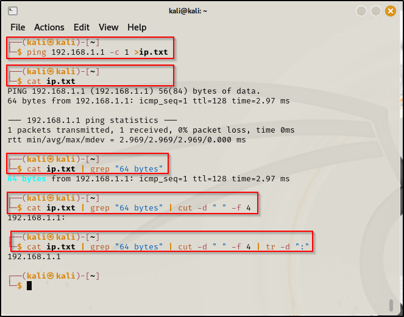

\
\
-c : To ping only one time.\
grep : To search plain text.\
-d : delimeter (where to perform the operation)\
-f : Grab the part.\
tr :Translate command used to delete.\
\
This process can be done using a for loop to get all IP\'s connected ti
my device :\
\
\
\
To enable execute operation and execute the program :\
\
\
\
More proper way to write it :\
\
\
\
Storing all the IP\'s :\
\
\
\
IMP\*\*\
nmap Scan : Port scan for an IP directly\
\
\
\
If we want to perform nmap for a bunch of IP\'s :\
\

