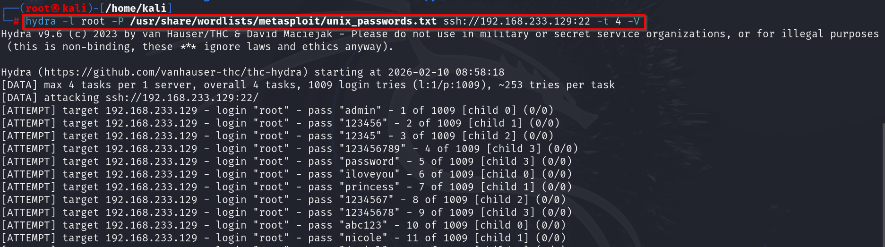

Hydra is a tool used for bruteforcing:\
\
-l indicates the lists of users we want to access\
-P is the password list\
We used unix_passwords.txt OR unix_users.txt\
-V indicates the verbosity\
-t indicates threads\
\
\
\
We can try the same using metasploit as well:\
\
Search for ssh and select ssh_login :\
\
\
\
After this we have to set as per out requirement.Here, since we want to
login as root and use a wordlist:\
\
\
\
We will set threads 10 and also verbosity true and run the bruteforce.
