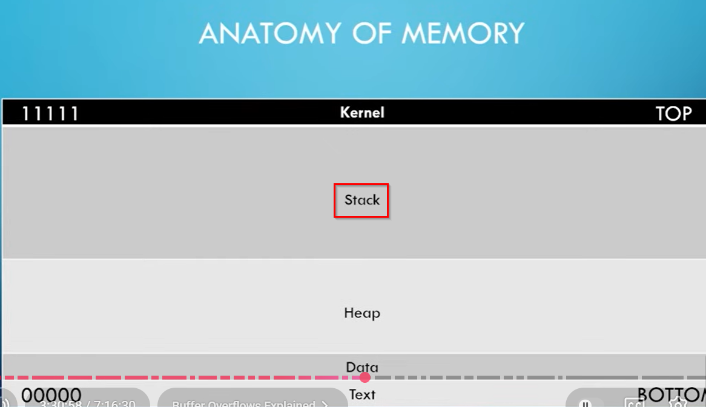

Consider this anatomy of memory :\
\
\
\
Stack is the layer we are most interested in.\
Stack structure is shown below:\
\
\
\
Now, the flow happens in the downward direction (from ESP to EIP)\
\
For efficiently sanitizing the stack, for example various characters are
flooded in the buffer space till it reaches the boundry.\
\
\
\
When a buffer overflow attack is launched, this space is overflowed by
more such characters reaching the EBP and EIP.\
\
\
\
\
Now since we have reached EIP, we can use the pointer register to point
toward the instruction we want.\
This instruction is basically malicious code, malware which will be used
to pop a shell.\
