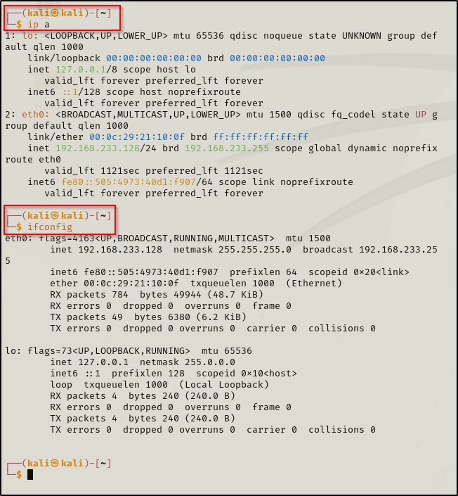

\
This tells us about wired connections.\
\
For wireless connections.\
\
\
\
\
If we want to map MAC address to IP address then :\
\
\
\
\
Routing :\
\
\
\
\
PING Command : Using Default Gateway\
\
It is used to check whether the machine is active and it is
responding.This is called the ICMP traffic.\
Here, if we dont get the responses \...doesnt necessarily mean the
machine is inactive.If the ICMP is disabled then the machine wont
respond to any ping commands.\
\
\
\
If we ping a different IP which is not in my network :\
\
\
\
