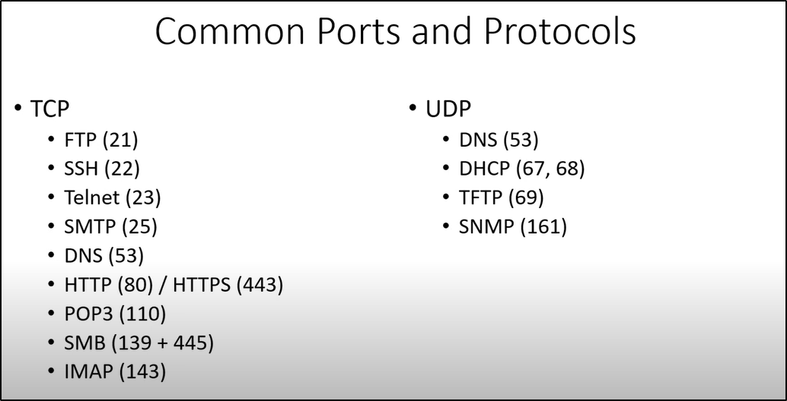

\
\
FTP (File Transfer Protocol) - Transfer computer files or access them.\
SSH (Secure Shell Protocol) - It is used to log into a computer securely
(It is encrypted)\
Telnet - It is used to log into a computer not so securely (It is
unencrypted)\
DNS (Domain Name System) - Used to convert name into IP Address (eg.
converts www.google.com into an IP Address)\
HTTP (unencrypted and rarely used) HTTPS (encrypted and commonly used)\
DHCP - Assigns random IP to the user for the req amt. of time (Its
opposite is static\....which assigns a specified IP which user can
access anytime)\
\
\
\
\
