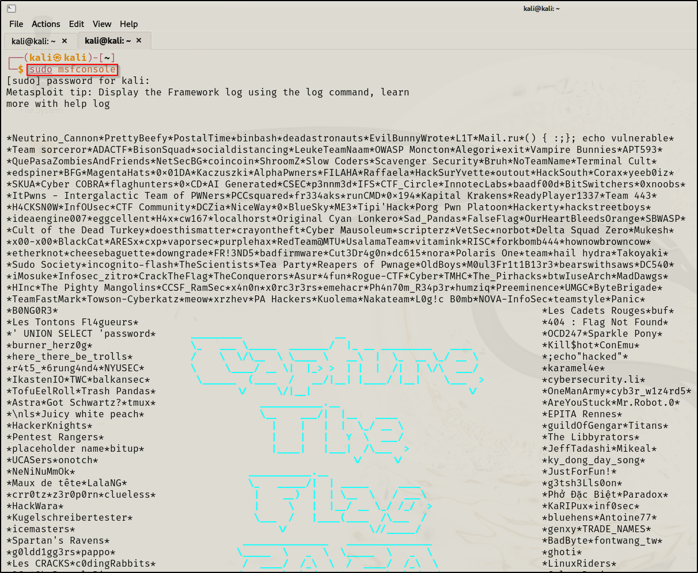

**To enumerate SMB (related to file transfer) we will use msfconsole\
msfconsole : Used to scan systems for vulnerabilities, conduct network
reconnaissance, launch exploits on target.\
\**
**\
\
Then we searched for SMB :\
\**
\
\
**We received \~150 results.To find the appropriate result we require :\
1) Since we are on the scanning and enumeration part , auxiliary
represents scanning and enumeration.Hence will search for auxiliary
first.\
2) Then we will search for smb and smb version since we want to know the
version used.\
\**
\
\
**From this we got a valueable info. that the smb version is (Samba
2.2.1a)\
\
Now we used an important tool called smbclient (used to access files
anonymously) :\
\
-L : List all files\
\**
\
**\
Here we tried to gain access of a file named ADMIN\$ anonymously but we
couldnt do it.\
Then we tried to gain access of another file IPC\$ and successfully
accessed it anonymously.\
\**
**\
\
But eventually we reached a dead end because it didnt allow us to access
the list in this file.**
