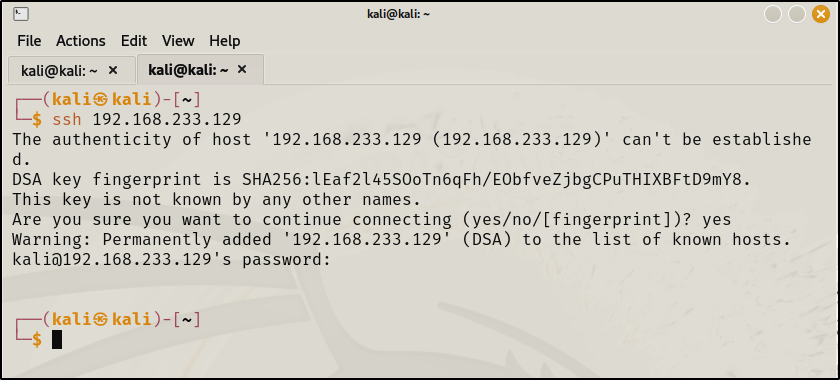

**For enumerating SSH (Used to log in but in encrypted way) :\
\**
**\
\
Sometimes it wont connect directly instead it will offer something in
return :\
Use the following pattern to connect ssh :\**
\
\
**\
Here since we dont know the password we will hit control c and exit.\
\
The main purpose of doing ssh is to connect to a computer in encyped
way.But if we dont know the password then ssh is\
also useful to get more information since some banner could be displayed
on the screen for password.(eg. the version could\
be exposed or the company who build it or the name of the person )\**
