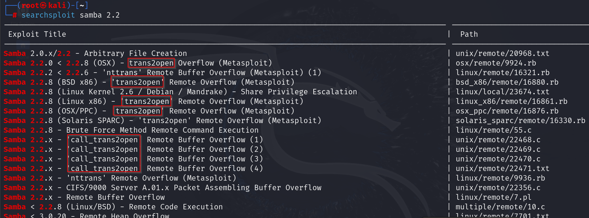

**Refer the part of the video : Gaining root with metasploit.\
\**
\
\
\
\
Trans2Open is mentioned so many times:\
So we will try to exploit it using metasploit:\
\
\
\
\
Set Rhost (target); 192.168.233.129\
\
\
\
The payload wasnt able to exploit the target (access a shell), So we
tried using a non-staged payload instead of a staged one using:\
\
\
\
After changing the payload we tried again and were able to find a shell
on the target machine as a root user:\
\
\
\
