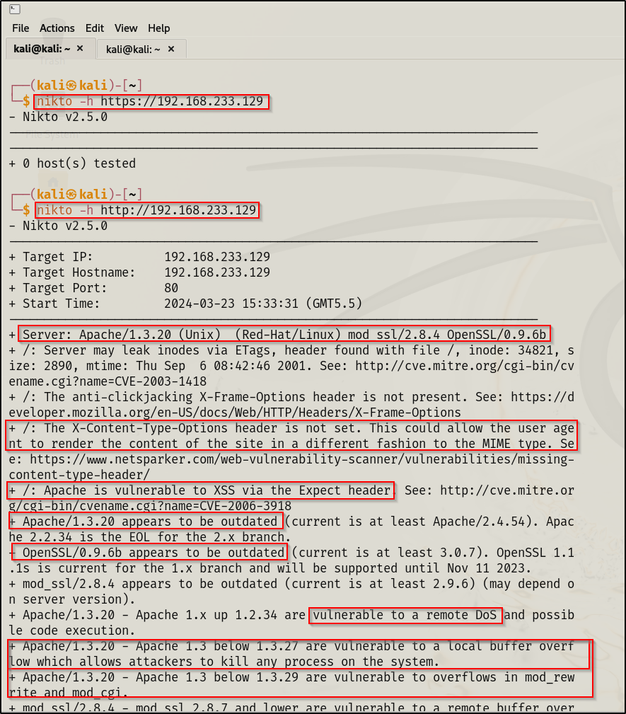

**Lets say we want to enumerate HTTP and HTTPS :\
\
The initial method will be accessing them using google :\
1)http://\<ip address of target\>\
2)https://\<ip address of the target\>\
\
By accessing these sites we will search for any possible information or
any other links that redirect\
to some other web page.\
\
We can also use an important tool in Kali :\
nikto -h \<ip address\>\
-h : Host\
\
\
[This nikto tool helps us to find possible vulnerabilities in web
servers and web applications.\]{.underline}
\
We saved this whole scan by making a directory called kioptrix , then
made a .txt file called nikto.txt\
and pasted the whole scan in it.\
\
Now for busting a directory (breaking into it) we can use various tools
in Kali :\
1)dirbuster\
2)dirb\
3)gobuster\
\
Lets use dirbuster for now :\
\
\*\*Refer the video\*\* : Enumerating HTTP/HTTPS part 2 in detail for
proper methodology.\
\
Another important tool called FFUF:\
\
pip install ffuf\
\
FOR ACADEMY MACHINE WE USED FFUF :\
\**
**\
\
Got this starting directories:\
\**
**\
\**
