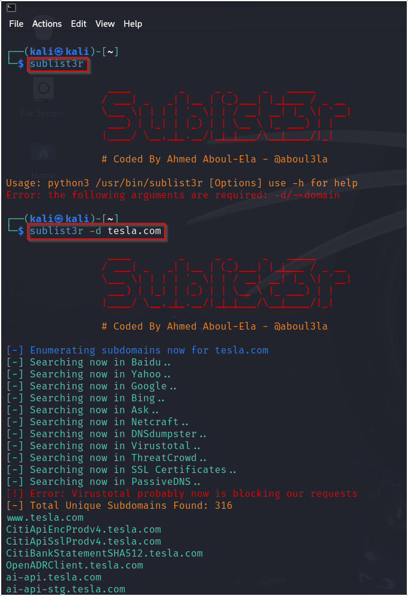

First install sublist3r using the command :\
\
**sudo apt install sublist3r\
\**
To find subdomains give the argument :\
\
**sublist3r -d** (domain name eg. tesla.com)\
\
\
\
\
\
**Another method of finding sub-domains : (Including sub-sub-domains)\
1) crt.sh\**
\
**\*\*Important tool in Kali Linux\*\* :\
\**
owasp**amass\
It is by default present in Kali Linux, installed using the command :\
\
sudo apt-get update\
sudo apt-get install amass\
\
Refer this website for detailed info about types of commands and their
uses :
https://www.dionach.com/how-to-use-owasp-amass-an-extensive-tutorial/\
\**
