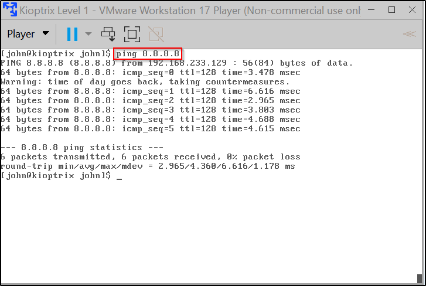

**USERNAME : john\
PASSWORD : TwoCows2\
Installed Kioptrix on VMware :\
Since it is an old machine and doesnt have ipconfig or ifconfig commands
we pinged\
a random ip address and got the ip of our Kioptrix virtual machine.\
\
Here the ip address of our kioptrix VM is [192.168.233.129]{.underline}\
\**
\
\
**We can also get the ip of our Kioptrix virtual machine using the
terminal in Kali :\
\
\**
\
\-\-\-\-\-\-\-\-\-\-\-\-\-\-\-\-\-\-\-\-\-\-\-\-\-\-\-\-\-\-\-\-\-\-\-\-\-\-\-\-\-\-\-\-\-\-\-\-\-\-\-\-\-\-\-\-\-\-\-\-\-\-\-\-\-\-\-\-\-\-\-\-\-\-\-\-\-\-\-\-\-\-\-\-\-\-\-\-\-\-\-\-\-\-\-\-\-\-\-\-\-\-\-\-\-\-\-\-\-\-\-\-\-\-\-\-\-\-\-\-\-\-\-\-\-\-\-\-\-\-\-\-\-\-\-\-\-\-\-\-\-\-\-\-\-\-\-\-\-\-\-\-\-\-\-\-\-\-\-\-\-\-\-\-\-\-\-\-\-\-\-\-\-\-\-\-\-\-\-\-\-\-\-\-\-\-\-\-\-\-\-\-\-\-\-\-\-\-\-\-\-\-\-\-\-\-\-\-\-\-\-\--\
**Now using ifconfig we got the ip our Kali Machine,\
Using the command : netdiscover -r \<ip address till 3 octet\>.0/24\
We got the ip address of the target on which we have to perform
nmap.(Note - Ignore the 1st,2nd and 4th ip\'s)\
\
Using the command : nmap -T4 -p- -A \<ip address of the target\>\
We performed nmap scanning\
\
{ nmap scanning - It is a network scanner which is used to detect open
ports and services on a computer network by\
sending packets and analyzing the responses.It is used to understand the
weaknesses that exist that a hacker could\
exploit.\
The packets are sent in the format : SYN SYNACK ACK for establishing
connection with the other network\.....but nmap performs :\
SYN SYNACK RST i.e it does not connect to the network by sending reset
request and just check whether the port is open and scans\
other information }\
\
-T4 : There are 5 speed levels(1-5).Here -T4 determines the speed of the
scan.\
-p- : Represents that all ports (65535) will be scanned.We can also scan
individual ports using -p 443,80,53.\
We can also use -p to scan top 1000 ports that are very common.\
-A : Represents that all the scanning regarding the ports should be done
and reported.\
\**
**\
\
NOTE : Use the command nmap \--h to know more about different other
scans we can perform using this.\**
