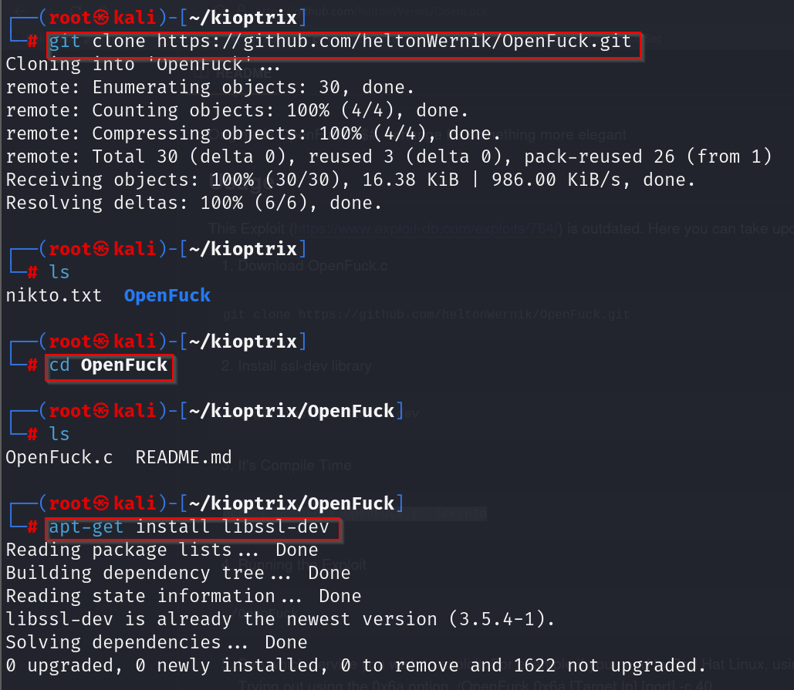

We saw an exploit on google by searching \"mod_ssl/2.8.4 - mod_ssl
2.8.7\"\
That exploit was on github and was called \"OpenFuck\"\
\
Using that exploit lets try gaining a remote shell:\
\
\
\
Used the commands setp-by-step:\
\
\
\
Uaed the syntax mentioned :\
\
\
\
\
Here used the target 0\*6b due to apache version 1.3.20 :\
\
\
\
Able to get a shell :\
\
\
\
