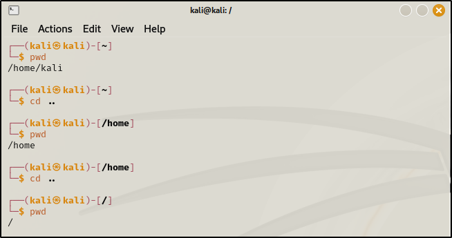

\
\
pwd (print working directory) : Used to know the directory in which we
are in.\
\[So here \~ represents /home/kali\]\
\
If we want to go backwards :\
cd (change directory) command is used along with 2 dots.\
\
\
\
\
\
\
ls (lists) : Check the folders or files availbale.\
\
If we want to change our directory midway\....it is not possible
directly.\
\
\
\
\
How to create our own directory :\
\
\
\
\
How to remove a directory :\
\
\
\
\
How to list All files and folders(hidden ones with . )\
\
\
\
\
\
\
\
Some more commands :\
\
\
\
\
\
How to copy a file and remove a file from a folder :\
\
\
\
\
How to move :\
\
\
\
\
\
How to locate a file :\
\
\
\
\
\
\
\
