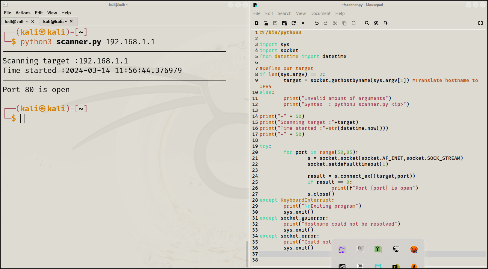

\
\
NOTE :\
The ip given in the command line is not the ip of Virtual machine,it is
the ip of windows machine.\
ex\_ returns value 0 if connected and gives 1 if does not connect.\
DNS concept is used to translate hostname into ip.(IN this case directly
ip is provided in command line)\
\
