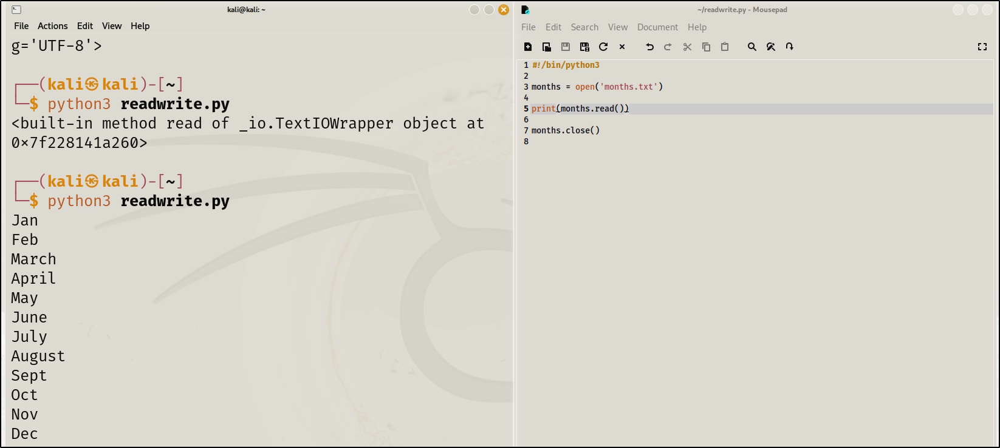

\
\
Here if we use only : print(months)\
\
Then it will print the name, mode and if readable or not.\
Hence we need to use print(months.read()) to display full content\
\
To read line by line :\
print(months.readline())\
\
WRITE OPERATION :\
\
\
\
\
If we use this operation again it will rewrite the file, to add
something to the existing file use \"a\" (append\
\
\
\
\
\
