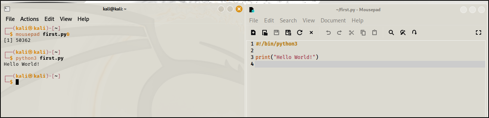

\
NOTE : & is used to run the mousepad and terminal simultaneously.\
We need to specify #!/bin/python3\
We can run the program by :\
1) python3 first.py\
2) ./first.py\
Also, \# is used to write comments.\
\
\
\
\
\
