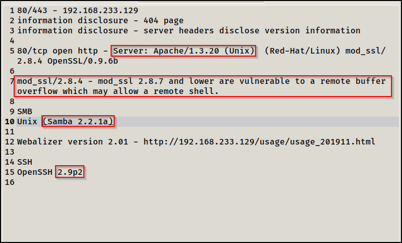

**We have written all the highlighted information in a text format.Lets
look at that information and search for vulnerabilities.\
\**
\
\
\
**\
\
\
\
\
\*\*HERE NOTE THAT RAPID7 WEBSITE IS VERY IMPORTANT\*\*\
\
Procedure : Search on google for exploits starting with the 7th line.\
eg. mod ssl 2.8.4 exploit and save the websites (containing potential
vulnerabilities) in a text doc.\
Do it for 5th line , 10 line as well.\
\
There is another way to do it in terminal besides using google.\
\
Tool in kali linux : searchsploit\
\**
**\
\
Note : Dont search too accurately because it directly searches for the
string we type.**
