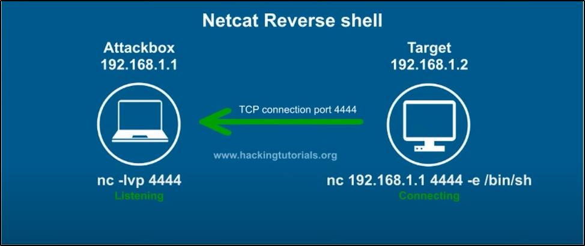

**Reverse shell : Target connects to us OR Victim connects to the
Attacker\
\**
**\
\
Bind shell : We connect to the target.\
\**
**\
\
\
Example of reverse shell (target connects to us) :\
\
Attackers device : nc - netcat , nvlp/lvp - listen verbal port\
\**
\
\
**Target\'s device : -e : establish\
\**
\
\
\
