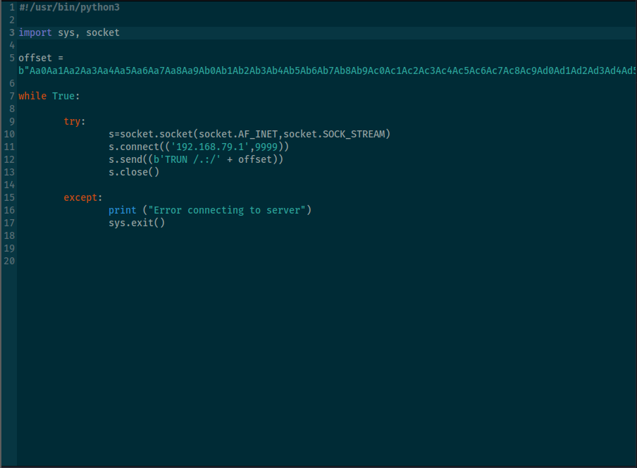

**Offset is the exact number of bytes required to reach and overwrite
the EIP (Instruction pointer) in memory.**\
Metasploit provides 2 tools:\
1) **pattern_create**\
2)**pattern_offset**\
\
Using **pattern_create**we generate a long string (we got the length of
string in fuzzing) of unique characters.\
\
\
\
We send this generated pattern to the script here:\
\
\
\
**The application crashes due to buffer overflow.**\
\
Vulnserver output:\
\
\
\
Immunity debugger Output:\
\
\
\
Here, we look at the the EIP register.\
**EIP = 386F4337**\
That value came from somewhere inside out pattern.\
\
\
Now , we give that EIP back to Metasploit using**pattern_offset**:\
\
\
\
Metasploit tell us the exact match:\
**In this case it was 2003**\
\
**This means after 2003 bytes the EIP gets overwritten.**\
