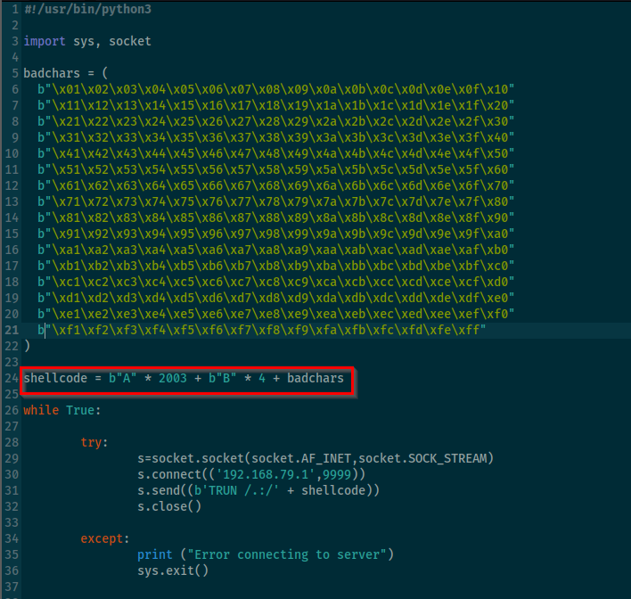

**Bad characters are bytes that interfere with the payload execution in
a buffer overflow exploit.**\
\
Most common example of a bad character is:\
\
**\\x00** (Because many programs treat \\x00 as end of string and hence
ignore the whole everything)\
\
We modified the script using a badchars repo in github:\
\
\
\
Now, we executed the script to watch the**HEX DUMP**and identify if any
**bad chars** exist.\
\
After execution on immunity debuffer, **we clicked on ESP and checked
follow hex dump**:\
\
\
\
**Verify Hex Dump manually and see if there are any missing characters,
these characters will be flagged and will be important during the next
stages:**\
\
\
\
**Our goal is to see if the sequence reaches FF properly.\**
\
Example of a bad character sequence:\
\
\
\
We can infer from above example that **04**is a badcharacter,
similarly**45,BE,CC**are bad character and need to be noted.\
**\*\*NOTE: When there are 2 consecutive bad characters visible, the
only bad character is the 1st one**.\*\*\
\
