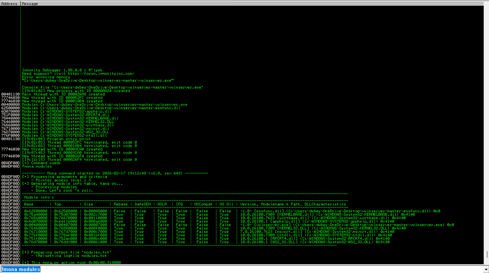

We searched for \'mona modules\' on google and downloaded
the**mona.py**file from github.\
\
We copied that file into :\
**C:\\Program Files (x86)\\Immunity Inc\\Immunity Debugger\\PyCommands.\
\**
Then on immunity debugger we searched for mona modules : **!mona
modules\
\
\
\**
We are basically looking for something **attached to vulnserver**and
with all the security permissions as **FALSE.\
\
Log data, item 15\
Address=0BADF00D\
Message= 0x62500000 \| 0x62508000 \| 0x00008000[\| False \| False \|
False \| False \| False \| False \|]{.underline}-1.0- \[essfunc.dll\]
(C:\\Users\\dubey\\OneDrive\\Desktop\\[vulnserver-master]{.underline}\\essfunc.dll)
0x0\
\**
This is the option we want.**(essfunc.dll because it has no ASLR, no
DEP, not randomized basically no security)**\
\
Now, since we are running immunity debugger and it uses HEX code
therefore we will convert **ASSEMBLY**to its **HEX CODE**equivalent.\
We used a tool called**nasm_shell**:\
\
\
\
**When a buffer overflow happens:\
1) Our input overwrites EIP\
2) ESP (stack pointer) points to our payload (shellcode)\
This means:\
1) Overwrite EIP with the address of a JMP ESP instruction.\
2) That instruction redirects execution of our payload.**\
\
So now on immunity we use mona modules to scan the essfunc.dll file with
JMP ESP. (**!mona find -s \"\\xff\\xe4\" -m essfunc.dll**)\
**Search for JMP ESP inside module essfunc.dll**\
\
\
\
We got this:\
\
**Log data, item 11\
Address=625011AF\
Message= 0x625011af : \"\\xff\\xe4\" \| {PAGE_EXECUTE_READ}
\[essfunc.dll\] ASLR: False, Rebase: False, SafeSEH: False, CFG: False,
OS: False, v-1.0-
(C:\\Users\\dubey\\OneDrive\\Desktop\\vulnserver-master\\essfunc.dll),
0x0**\
\
Now we got the return address as**625011af** and now we will **replace
the EIP as 625011af**in our python script.\
\
\
\
***[!!!The order is different because of the x86
architecture.]{.underline}*\**
\
Now on immunity debugger we went to **\'go to address disassembler**\'
option and set it to \'**625011af\'\
\
\
\**
After that we clicked on**f2** to hit a **breakpoint**so that when we
overflow the buffer and reach to this jump code we will not **jump to
further instructions**and hit a break point and pause so that the
**program waits for us for further instructions**.\
\
After all this steps, we **execute 1.py**:\
\
\
\
We were successful in overwriting the EIP with the JMP ESP instruction.
