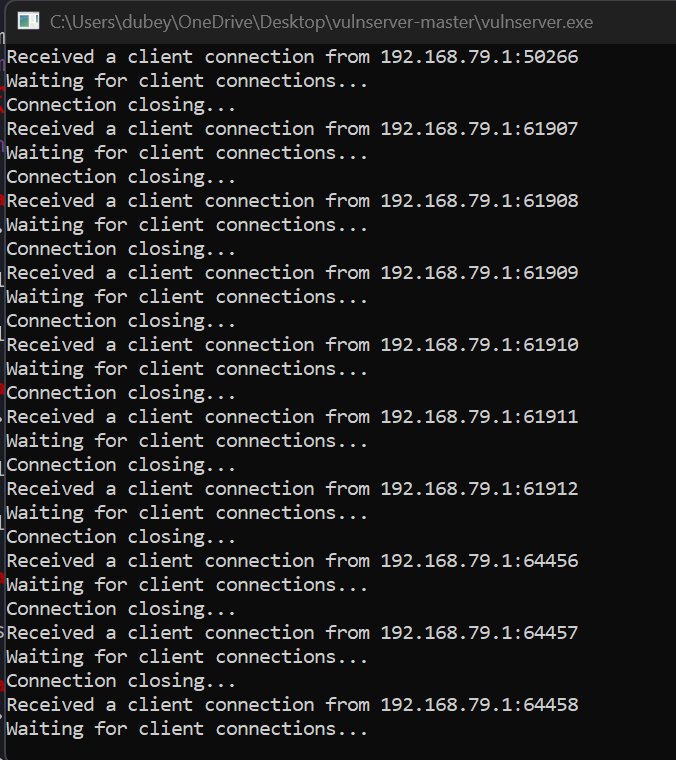

Fuzzing is also similar to spiking.\
Consider the script :\
\
\
\
We saved this script into a file called **1.py**and ran it while
vulnserver and immunity debugger were kept open.\
\
Vulnserver output:\
\
\
\
\
\
\
Here, we got this output:\
\
\
\
The bytes at which fuzzing crashed is important for us in next steps.
