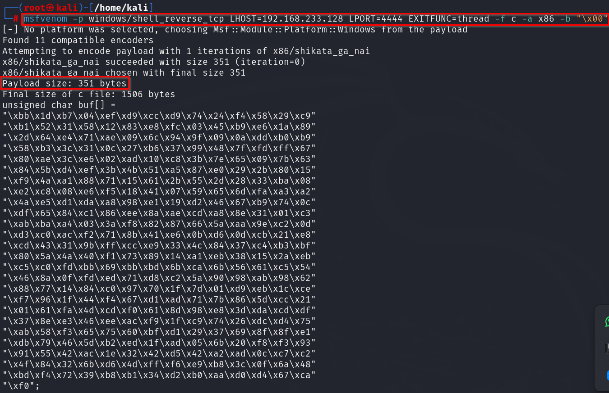

Now, using msfvenom:\
\
-p is for payload type\
EXITFUNC=thread is for stability of the payload\
-f is for filetype (here c)\
-a is for architecture (x86)\
-b is for badchars\
\
\
\
In the python script:\
\
Here, we have added some padding \[ b\"\\x90\" \* 32 \]\
\
\
\
After this we listen on port 4444 and keep vulnserver running as admin ,
this time no immunity:\
\
\
\
Executing 1.py:\
\
\
\
Vulnserver output:\
\
\
\
On port 4444 we have gained a windows shell:\
\
\
\
\
\
\
