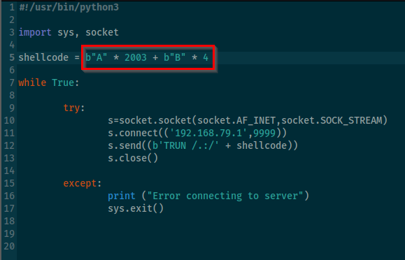

Now, since we know the byte at which the EIP can be over-written:\
\
**We will send multiple A\'s till EIP and only 4 B\'s after that meaning
we want to see only B\'s in EIP and rest A\'s in all registors.\
This is the see if we can control the EIP registor.\**
\
\
\
A\'s in ASCII are represented as 41414141 (AAAA) and B\'s using 42424242
(BBBB).\
\
Now we run the script again and see if we can actually manipulate the
EIP:\
\
\
\
Here, we can see 42424242 in EIP meaning **now we can control the
EIP.**\
