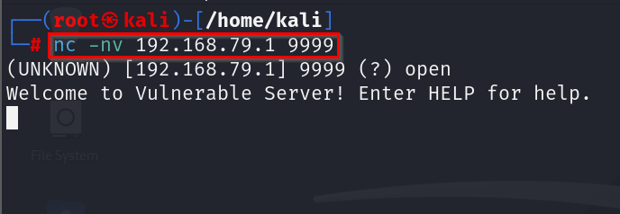

Here, we turned off real-time protection on our target device (here
windows)\
\
We will run**vulnserver** and **immunity debugger** as administrator.\
\
After that, on imunity debugger go the file and attach vulnserver.\
\
After that on the kali machine we will use netcat to connect to the port
9999 (since vulnserver runs on 9999 default).\
\
\
\
\
\
\
We will use different comands mentioned below the overfow the buffer, we
are gonna do this by throwing bunch of characters and overflow it :\
\
\
\
EXAMPLE:\
Lets try using STATS command to overflow.\
\
We use generic_send \_tcp and the syntax is shown below.\
It requires the **host \| port \| spike_script\
\**
The spike_script is replacing the string with a random character and
trying to overflow.For other commands mentioned above we have to replace
the \"STATS\" with them.\
\
\
\
\
\
\
\
\
This is the vulnserver shell output:\
\
\
\
This is the immunity debugger output:\
\
\
\
WE CAN INFER FROM ABOVE THAT THERE IS NOTHING HAPPENING FROM
**STATS**AND HENCE WE CANNOT OVERFLOW THE BUFFER FROM IT.\
\
\
Next we triedfor **TRUN** because it can overfow the buffer.\
\
\
\
Vulnserver Output:\
\
\
\
**\*\*Immunity debugger output\*\*:**\
\
\
\
Here we can clearly see **ESP EBP**and**EIP**were**overflowed by bunch
of A\'s.\
There is also an error message displayed \"Access violation when
executing \[41414141\]\"\**
We clearly overflowed the registors we wanted to and now can point this
registor to our malicious code.\
