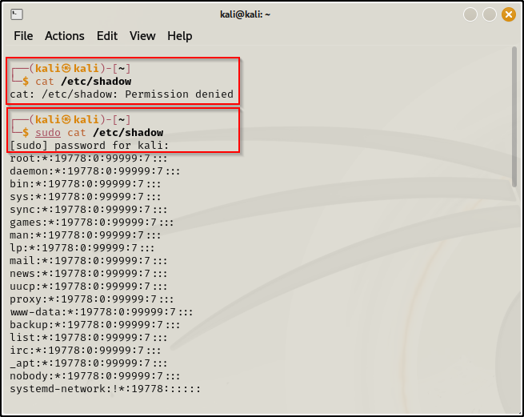

SUDO command= Allows user to run programs with the security previleges
of another user.It prompts for a password and confirms the request.\
\
\
\
If we want to change from kali to root kali then\
\
\
\
\
NOTE : (kali@kali)-\[\~\]\
The first kali represents the username which can be changed to root by
using switch user (su) command.\
Second kali represents the name of the device.\
\~ represents the directory in which we are in.\
\
\
\
\
\
\
