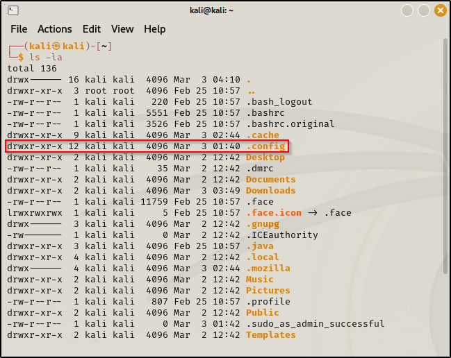

\
\
Starting with \'d\' are directories\
Starting with \'-\' are files\
Starting with \'l\' are links\
\
Look at the foll. example :\
d rwx r-x r-x\
The first part represents what the owner of the file can perform.
(Read,write and execute in this case)\
Second part represents what the group member can perform. (Read and
execute only in this case)\
Third part represents what all other users can do. (Read and execute in
this case\
\
How to change the preferences (i.e Read,write,execute) :\
\
\
\
Command used : chmod (change mode)\
\
Another method of doing it :\
\
\
\
\
\
\
How to add user :\
\
\
\
\
Some important learnings about the machine using this command :\
\
\
\
**[Refer the User Privileges part of the video.\]{.underline}**
\
\
