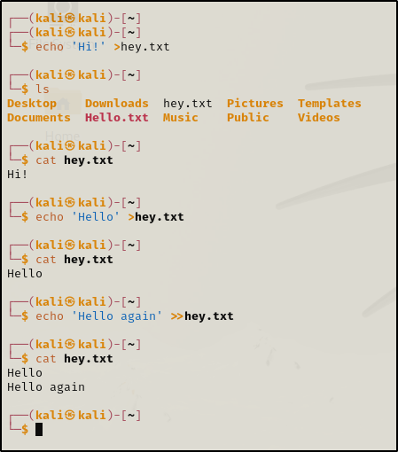

\
\
\'\>\' - It overrides the statement.\
\'\>\>\' - Does not override and includes previous statement.\
\
How to create a new file :\
\
\
\
Editing a file :\
\
\
\
Another method :\
\
\
\
NOTE : The file doesnt have to be existing to use \'nano\' or
\'mousepad\'.We can directly create and edit the file.\
